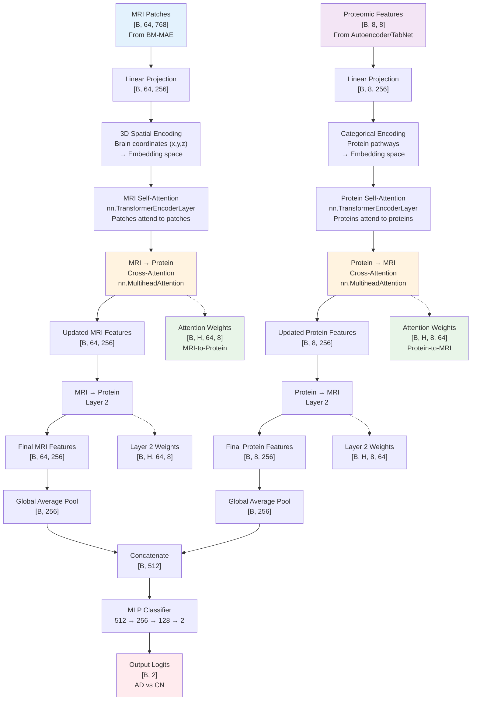

# Cross-Attention Transformer Architecture for Multimodal AD Classification

## Complete Architecture Flow Diagram

## Key Innovation: Cross-Modal Communication

The core innovation is the **bidirectional cross-attention** mechanism:

1. **MRI → Protein**: "Given this brain pattern, which proteins are most relevant?"
2. **Protein → MRI**: "Given this protein signature, which brain regions matter?"

This allows the model to discover **spatial-molecular associations** that are critical for understanding Alzheimer's disease mechanisms.

## Interpretability Through Attention

The attention weights provide direct insights into:
- Which brain regions correlate with which proteins
- How disease patterns differ from healthy patterns  
- What drives each individual prediction
- Novel biomarker combinations for diagnosis